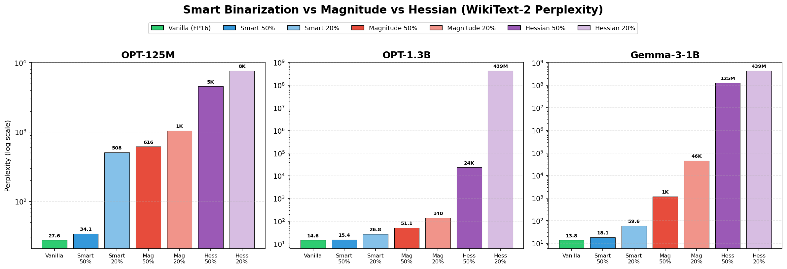

# Smart Binarization: LLM Quantization Framework

This is a project where I am trying to check how far I can push this selective binarization approach. So, this is a framework for developing and evaluating smart binarization strategies for large language models. This project combines GPTQ-based quantization with quantization-aware training (QAT) to achieve extreme low-bit quantization while maintaining model performance.

## Results Summary

**Smart Binarization** implements partially-binarized LLM quantization, where a small ratio of salient weights are preserved in higher precision while the majority are binarized to extreme compression.



**Key Results:**
- **OPT-1.3B**: Smart binarization at 50% achieves only **+5.4% degradation!**
- **Gemma-3-1B**: Smart is **64× better** than magnitude at 50% salient
- **OPT-125M**: Smart is **18× better** than magnitude at 50% salient
- The activation-aware saliency consistently outperforms magnitude-based methods across all models

## Quick Start

### Smart Binarization (New)

```bash
cd "/home/uzair/code/smart binarization"

# Run smart binarization with 50% salient weights
python run_smart_binarization.py facebook/opt-125m wikitext2 --p_global 0.5 --eval

# Compare all 3 saliency methods
python compare_methods.py facebook/opt-125m wikitext2 \
    --methods vanilla magnitude hessian smart --p_global 0.2 0.5
```

### Legacy Evaluation

```bash
# Vanilla model only
python evaluate_models.py --vanilla

# Generate quantized checkpoint and evaluate
python generate_quantized_checkpoint.py --nsamples 128
python evaluate_models.py --smart-bin
```

### Run Full Quantization Pipeline

```bash
cd gptq_pb

# Standard parameters (80% binary, magnitude saliency)
python run.py facebook/opt-125m wikitext2 xnor \
  --nsamples 128 --low_frac 0.8 --high_bit 8 --salient_metric magnitude

# Better quality (50% binary, hessian saliency)
python run.py facebook/opt-125m wikitext2 xnor \
  --nsamples 128 --low_frac 0.5 --high_bit 8 --salient_metric hessian

# Try 2-bit quantization
python run.py facebook/opt-125m wikitext2 2bit \
  --nsamples 128 --low_frac 0.8 --high_bit 8 --salient_metric magnitude
```

## Framework Architecture

### Tested Models

* ✓ facebook/opt-125m 
* ✓ facebook/opt-1.3b
* ✓ google/gemma-3-1b-pt 

### Quantization Methods

* ✓ `xnor` - Binary quantization (XNOR operation)
* ✓ `sign` - Sign-based binary
* ✓ `2bit` - 2-bit quantization
* ✓ `4bit` - 4-bit quantization
* ✓ `no` - No quantization (baseline)

### Saliency Metrics

* ✓ `magnitude` - Weight magnitude ranking (fast)
* ✓ `hessian` - Hessian-based saliency (better quality, slower)
* ✓ `activation-based` – my implementation (check out [Implemented.md](Implemented.md) for more details)


### Datasets

* ✓ **wikitext2** (cached) - 36K train, primary calibration
* ✓ **wikitext-103-v1** (cached) - 1.8M train, thorough evaluation
* ✓ **c4** (auto-download) - Large-scale pretraining corpus

## Performance Optimization Guide

### Improve Quality from 858 PPL

1. **Lower binarization fraction**

   ```bash
   python run.py ... --low_frac 0.5  # Try 50% instead of 80%
   ```

2. **Better saliency detection**

   ```bash
   python run.py ... --salient_metric hessian  # vs magnitude
   ```

3. **Quantization-aware training**

   ```bash
   cd qat
   python run_qat.py facebook/opt-125m wikitext2 xnor
   ```

4. **Higher precision for salient weights**

   ```bash
   python run.py ... --high_bit 16  # vs 8-bit
   ```

5. **Multi-method comparison**

   * Test sign, 2bit, 4bit quantization
   * Compare results side-by-side

## Testing

### Quick Test (1 minute)

```bash
python test_suite.py --quick
```

### Standard Test (5 minutes)

```bash
python test_suite.py
```

### Thorough Test (30 minutes)

```bash
python test_suite.py --thorough
```

### Manual Verification

```bash
python evaluate_models.py --vanilla   # Should get PPL ≈ 28.62
python evaluate_models.py --compare   # Compare both
python final_comparison_report.py     # Comprehensive summary
```

## Key Scripts Reference

### evaluate_models.py

```bash
# Evaluate vanilla model
python evaluate_models.py --vanilla

# Evaluate smart binarization
python evaluate_models.py --smart-bin

# Compare both (default)
python evaluate_models.py --compare

# Options
--model TEXT              Model ID (default: facebook/opt-125m)
--dataset TEXT            Dataset (default: wikitext2)
```

### generate_quantized_checkpoint.py

```bash
python generate_quantized_checkpoint.py \
  --model facebook/opt-125m \
  --dataset wikitext2 \
  --nsamples 128 \
  --low-frac 0.8 \
  --high-bit 8 \
  --salient-metric magnitude
```

### compare_models.py

```bash
python compare_models.py \
  --model facebook/opt-125m \
  --dataset wikitext2
```

### final_comparison_report.py

```bash
python final_comparison_report.py
# Generates comprehensive comparison with insights and next steps
```

### Output Locations

* **Evaluation results**: `eval_results/`

  * `comparison_results_*.json` - Structured metrics (JSON)
  * `comparison_report_*.txt` - Formatted comparison
  * `final_comparison_*.txt` - Comprehensive summary with insights and next steps

* **Quantization outputs**: `gptq_pb/outputs/mask/`

  * Saved quantization masks for each layer

* **Cached datasets**: `~/.cache/huggingface/datasets/`

  * Preprocessed for fast loading

### Parse Results

```python
import json
with open('eval_results/comparison_results_*.json') as f:
    results = json.load(f)
    print(results['vanilla']['perplexity'])
    print(results['smart_binarization']['memory'])
```

## Contributing

To implement a new quantization algorithm:

1. Create quantizer class in `quant/`
2. Update `evaluate_models.py` with model type
3. Run evaluations with framework
4. Compare against baselines
5. Document methodology and results

## References

* **Original PB-LLM Paper**: [arxiv.org/abs/2310.00034](https://arxiv.org/abs/2310.00034)

  * Authors: Yuzhang Shang, Zhihang Yuan, Qiang Wu, Zhen Dong
  * Partially-Binarized LLMs via post-training quantization (GPTQ) and QAT

**Framework is complete and ready for algorithm development!**

* All baseline metrics locked
* Evaluation infrastructure validated
* Datasets cached for reproducibility
* Ready to implement and test custom algorithms

---

**Last Updated:** January 14, 2026
**Project Status:** Activation-aware saliency implemented and validated
